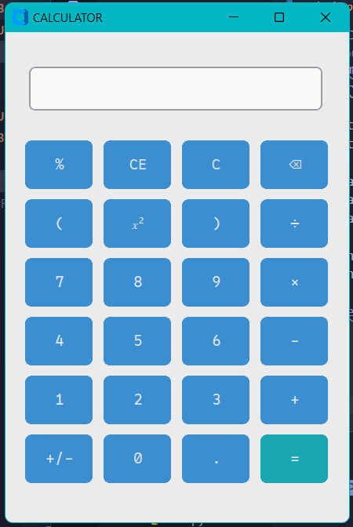
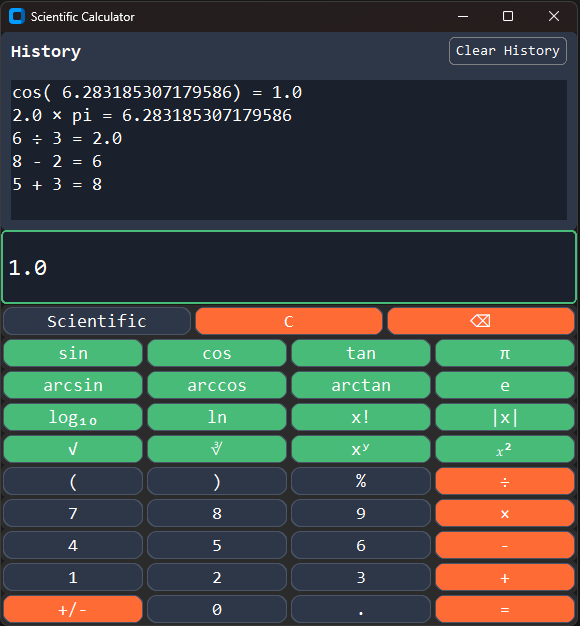

# Simple Calculator using Python Tkinter

This directory contains the source code for a simple graphical calculator application written in Python using the Tkinter library. This project is a fork that has been enhanced with additional features and an improved user interface.
<br />

## Description

This Python code creates a basic calculator application with a graphical user interface (GUI). The GUI is built using the CustomTkinter library, which provides a modern look and feel.

The calculator can perform the following operations:

### Standard Mode

- Addition (+)
- Subtraction (-)
- Multiplication (\*)
- Division (/)
- Exponentiation (x²)
- Modulo (%)

### Scientific Mode

- Trigonometric functions (sin, cos, tan)
- Inverse trigonometric functions (arcsin, arccos, arctan)
- Natural logarithm (ln)
- Base-10 logarithm (log)
- Square root (√)
- Cube root (∛)
- Power functions (xʸ)
- Factorial (x!)
- Absolute value (|x|)
- Pi (π) and Euler's number (e)

The calculator also includes these features:

- **Mode Toggle**: Switch between Standard and Scientific calculator layouts with a dedicated toggle button.
- **History Panel**: View previous calculations in a dedicated history panel, with clickable entries to reuse results.
- **History Clear**: Clear all history entries with a dedicated "Clear History" button.
- **Keyboard Support**: Full keyboard support including:
  - Numbers and basic operators
  - Enter key to evaluate expressions
  - Backspace to delete characters
  - C or Escape to clear display
  - Automatic operator conversion (\* becomes ×, / becomes ÷)
- **Clear Entry (C)**: Clears the current expression in the input field.
- **Backspace (⌫)**: Deletes the last character from the input field.
- **Change Sign (+/-)**: Inverts the sign of the current number or expression.
- **Parentheses Support**: Use parentheses for complex expressions.
- **Resizable Window**: The application window can be resized, and the layout will adjust accordingly.
- **Modern Dark Theme**: Clean, modern interface with dark theme and color-coded buttons.
- **Error Handling**: Comprehensive error handling for invalid expressions.

The calculator has a designated input field for entering expressions. Clicking the equals (=) button or pressing 'Enter' evaluates the expression, displaying the result in the input field and adding the calculation to the history.
<br />

## Screenshots

### Before:



### After:



<br />

## Requirements

- Python 3.x
- Tkinter library (included in most standard Python installations)

- CustomTkinter library (v2)

<br />

## How to Run

1. Run `pip install customtkinter`
2. Open a terminal window and navigate to the directory where you saved the file.
3. Run the following command in the terminal:

<br/>

```python
python calc_v2.0.py
```

This will launch the calculator application.

<br />

## Acknowledgments

This code utilizes the CustomTkinter library, which builds upon the standard Tkinter library to provide enhanced features and a modern look. The original project was forked and significantly improved by our team.

<br/>

## License

<br />

This project is licensed under the MIT License.
